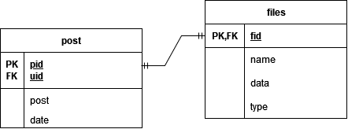

# Dokumentation

## Installationsanleitung
build.bat für Windows ausführen oder build_unix.sh für Linux oder macOS.

## Projektstruktur
Die Struktur orientiert sich an dem MVC Prinzip.

### public
- **js**: Hier befinden sich alle JavaScript-Dateien, die für das Frontend bestimmt sind.
- **css**: Hier befinden sich alle CSS-Dateien, die das Styling der Webseite regeln.
- **html**: Hier befinden sich statische HTML-Dateien, falls solche verwendet werden. Meistens werden diese jedoch durch die EJS-Dateien im View-Ordner ersetzt.

### config
- In diesem Ordner liegen alle Konfigurationsdateien, die für die Anwendung benötigt werden. Dies könnten z.B. Datenbankkonfigurationen, Umgebungsvariablen oder andere anwendungsspezifische Einstellungen sein.

### routes
- Dieser Ordner enthält alle Router-Dateien, die die verschiedenen Endpunkte der Anwendung definieren. Hier werden die Routen für HTTP-Anfragen definiert und die entsprechenden Controller aufgerufen.

### views
- Hier befinden sich die EJS-Dateien (Embedded JavaScript), die für die Darstellung der dynamischen Inhalte auf der Webseite verantwortlich sind. Diese Dateien kombinieren HTML mit JavaScript, um dynamische Webseiten zu erstellen.

### controllers
- In diesem Ordner liegen die Controller-Dateien, die die Logik der Anwendung enthalten. Sie verarbeiten die eingehenden Anfragen, interagieren mit den Modellen und wählen die entsprechenden Views aus, um die Antworten zurückzugeben.

### models
- Dieser Ordner enthält die Model-Dateien, die die Datenstrukturen und Geschäftslogik definieren. Hier wird die Interaktion mit der Datenbank gehandhabt.

### app.js
- Dies ist die zentrale Datei, die den Express-Server konfiguriert und startet. Hier werden alle Middleware, Routen und sonstige Einstellungen der Anwendung definiert.

## Erklärung der grundsätzlichen Struktur

### Frontend-Code
- **public/js**: Hier wird der JavaScript-Code abgelegt, der im Browser ausgeführt wird.
- **public/css**: Hier wird das Styling der Webseite definiert.
- **public/html**: Enthält statische HTML-Dateien (wenn verwendet).
- **views**: Enthält die EJS-Dateien, die für das Rendern der dynamischen HTML-Seiten zuständig sind.

### Backend-Code
- **routes**: Enthält die Definitionen der Endpunkte der Anwendung.
- **controllers**: Enthält die Logik für die Verarbeitung der Anfragen und die Auswahl der Views.
- **models**: Enthält die Definitionen der Datenstrukturen und Geschäftslogik.
- **config**: Enthält Konfigurationsdateien für die Anwendung.
- **index.js**: Startet und konfiguriert den Express-Server.

### Externe Bibliotheken/Frameworks
- **Express**: Ein minimalistisches Webframework für Node.js, das für den Aufbau des Servers und das Routing verwendet wird.
- **EJS**: Eine Template-Engine, die es ermöglicht, HTML mit eingebettetem JavaScript zu verwenden, um dynamische Webseiten zu erstellen.
- **cookie-parser**: Middleware zur Verarbeitung von Cookies.
- **express-session**: Middleware zur Verwaltung von Sitzungen.
- **mysql**: MySQL-Datenbank-Client.
- **mysql2**: Ein schnellerer und modernerer MySQL-Client.
- **multer**: Middleware zur Verarbeitung von Datei-Uploads.
- **sharp**: Ein Hochleistungs-Bildverarbeitungsmodul.

## Dokumentation Eigenleistung

### Lukas Scharnweber

Implementation des AutoFetch-Features zum automatischen Nachladen von neuen, sowie vergangenen Posts im Hintergrund, was kein manuelles Neuladen der Seite erfordert.
Als Frontend-Leistung werden dabei...
a) Posts, welche von Anderen erstellt wurden, während man selbst gerade aktiv ist, oben eingefügt und deren Inhalt (Text, Bild, Video) dargestellt.
b) Ältere Posts unten eingefügt, wobei durch herunterscrollen weitere ältere Posts geladen werden können (Infinity-Scroll).
Der Code dafür findet sich in der src\public\js\autoFetch.js-Datei.

Die src/controller/autoFetchController.js-Datei enthält die Middlewares und beinhaltet das Error Handling, da die Methoden dieser Datei für das Tätigen von Requests verwendet werden. Zudem befindet sich hier der Teil des Backend-Codes, welcher für dieses Feature spezifische SQL-Anfragen aus der /src/model/mySqlHandler.js-Datei aufruft (nämlich:  getPostCountForUID, getPostsForUID, getPostsByUids, getAllUsers, getPostCountForUIDs) und deren result an das FrontEnd weiterdelegiert.

Zugrunde liegende Ideen dieser Implementation waren, dass das Laden von neuen bzw. alten Posts ohne zutun des Users automatisch im Hintegrund geschehen soll, weshalb im Frontend alle zwei Sekunden in der startAutoFetchRoutine()-Methode eine Anfrage für die Anzahl der Posts für die spezifizierten UIDs gestellt wird, welche mit lokal pro User gecachten Werten verglichen wird und bei einer Änderung die Differenz von der neuen und der gespeicherten Anzahl von Posts für diesen User nachgeladen ubnd anschließend eingefügt wird. Dieser Feature funktioniert geräteübergreifend (wenn User A einen Post erstellt, wird dieser automatisch bei User B gefetched und angezeigt, sofern dieser die Posts von User A empfangen will (d.h. wenn die UID von User B in dem Array an zu überwachenden UIDs ist oder dieses -1 ist (alle Posts laden))).

Weitegehend wurde während des Entwicklungsvorgangs dieses Features die Entscheidung getroffen, die Anzahl der benötigten Requests während des Ladevorgangs der initial angezeigten Timeline möglichst gering zu halten, wodurch unter anderem das lokale Caching der zu UIDs zugehörigen Usernames beim initalen Laden der Timeline in der buildPostTimeline()-Funktion entstand.

Das Einfügen von Posts oben bzw unten von der Timeline wird durch das Differenzieren anhand des Creation Date eines Posts vorgenommen, wobei geringfügige Zusatzmaßnahmen benötigt werden, um die Korrektheit der erstellten Logik auch bei hohen Serverladezeiten etc. zu gewährleisten; genaueres hierzu in der Dokumentation der fetchLastNPosts-Methode, welche das Laden von jeglichen Posts übernimmt.

### Sebastian Albert

### Alexander Fleig

### Alexander Fleig

#### Post erstellen Funktion

Die Post erstellen Funktion dient dazu, dass der User auf der Webseite Inhalte hochladen kann, die dann von anderen Usern gesehen werden können. Das umfasst Bilder, Videos und Texte. Die Funktion erlaubt lediglich das Erstellen von Posts; das Anzeigen auf der GUI übernimmt die Autofetch-Funktion.

##### Frontend

Auf der Start-GUI werden Input-Felder angezeigt, in die die User entweder einen Textpost in ein Input vom `type="text"` eingeben können, ein Bild oder Video hochladen über Input `type="file"` oder beides. Nachdem der Submit-Button gedrückt wird, wird ein Event in der Datei `postEventHandler.js` getriggert, welches prüft, ob Text eingefügt wurde oder ein Bild (damit keine leeren Posts gesendet werden können). Serverseitig würde es ebenfalls in der Datenbank abgefangen werden, allerdings verbessert es die User Experience, wenn der User direkt weiß, wenn eine Aktion nicht möglich ist. Der Funktionsrumpf des Events ruft die Funktion `setPost(form)` auf, in der das FormData-Formular übergeben wird, welches die User-Input-Daten beinhaltet. Hierbei wird das Keyword `await` benutzt, da auf die Response gewartet werden soll, damit der Post erst hochgeladen wird, wenn er tatsächlich auf dem Server gelandet ist. Die Funktion befindet sich in `api.js`. Diese Funktion ruft die Funktion `mpfd("/blog/post", formData)` auf und übergibt den Pfad und das Formular. Die Funktion `mpfd = async (path, formData)` sendet eine Request mit dem FormData-Objekt an den Server. Hierfür wird `fetch(url, metaInfo)` benutzt, wobei sich das FormData-Objekt in `metaInfo` befindet.

##### Backend

Im Routes-Ordner befindet sich die Datei `post.js`, in der die Middlewares für den Pfad `"/"` hinterlegt sind (insgesamt `/blog/post/`). In `index.js` wird mit `app.use("/blog/post", checkSignedIn, post);` die Post-Route deklariert. Vorher wird aber noch die Middleware `checkSignedIn` aufgerufen, welche prüft, ob der User angemeldet ist. Falls nicht, wird er zu der Anmeldemaske redirected. 
In `post.js` ruft er zuerst die Middleware `resizeImage` auf, die sich in der Controller-Datei `postController.js` befindet. Generell befinden sich alle Middlewares, die für die Posts bereitstehen, in dieser Datei. Die Zeilen 
`if (!req.file || req.file.mimetype.split("/")[0] == "video") {
        return next();
}`
prüfen, ob ein File-Objekt in der Request enthalten ist oder ob es sich um ein Video handelt. Falls ja, wird die nächste Middleware aufgerufen. Ansonsten wird das npm-Paket `sharp` genutzt, mit dem die Metadaten des Bildes in eine Variable gespeichert werden. Mit 
`await sharp(req.file.buffer)
                .resize(newWidth, newHeight) // Ändere die Größe auf 300x300
                .toBuffer();`
wird die Größe des Bildes angepasst. Damit soll zum einen Speicherplatz geschont werden. Zum anderen soll der Traffic reduziert werden, da sonst lange Ladezeiten bei den Posts entstehen können. Danach wird die Middleware `createPost` aufgerufen, welche den Text und/oder das Bild/Video in die Datenbank speichert. Hierbei werden Bild/Video und Text separat an die Datenbank geschickt. Dies liegt daran, dass bei der Entwicklung zuerst das Senden von Textnachrichten im Fokus stand und deshalb die Funktionen separat implementiert wurden. Wenn der User nur ein Bild hochlädt, wird trotzdem ein leerer Text in der Datenbank gespeichert, was an der Datenbankstruktur liegt. Darauf und auf die SQL-Schnittstelle wird später genauer eingegangen. Nachdem der Post in der Datenbank gespeichert wurde, wird eine Response gesendet, mit dem Statuscode 200. Zusätzlich werden noch andere Daten in Form von JSON gesendet, unter anderem die ID vom Post (`pid`), da diese in den HTML-Post-Elementen gespeichert wird (`id=pid`), damit die Like-Funktion weiß, welcher Post geliked wurde.

##### Datenbank und Datenbankschnittstelle

Allgemein haben wir uns für SQL als Datenbanksprache entschieden, da zum einen die gespeicherten Daten nicht dynamisch angelegt werden müssen und es gut implementierbar ist mit statischen Tabellen. Zum anderen herrscht mehr Vorerfahrung mit SQL, im Gegensatz zu anderen Alternativen wie z.B. MongoDB.
In dem Ordner `model` befindet sich die Datei `mysqlHandler.js`, welche als Schnittstelle zur Datenbank dient. Dort befinden sich die Funktionen `setPost(uid, post)` und `setFile(pid, data, type)`, welche für das Speichern der Daten genutzt werden. In der SQL-Tabelle `post` werden Metadaten der Posts gespeichert, sowie der Text selbst und die ID (`pid`) des Posts. Des Weiteren gibt es die Tabelle `files`, in der die Bild-/Videodatei enthalten ist, sowie Metadaten und die File-ID (`fid`). Siehe Abb.

Die `fid` dient als Fremdschlüssel und steht in Relation zur `pid`. Hierbei herrscht eine 1-zu-1-Beziehung. Deshalb wird, wie oben schon erwähnt, immer ein Text gespeichert, auch wenn nur ein Bild/Video gesendet wird. Denn nur über einen Post-Eintrag entsteht eine Verknüpfung zu einem Bild/Video. 

Die beiden Funktionen rufen jeweils die Funktion `connectAndQuery2` auf. In dieser Funktion wird das `mysql2`-Paket genutzt, damit asynchrone Requests an den SQL-Server gesendet werden können. In der vorherigen Funktion, `connectAndQuery`, wurde das Paket `mysql` verwendet, welches keine asynchronen Funktionen bereitstellt. Um das zu umgehen, wird das `util`-Paket verwendet, um eine Funktion in eine asynchrone Promise-Funktion zu konvertieren. Diese Funktion ist deshalb noch enthalten, da wir erst während der Entwicklung bemerkt haben, dass `mysql2` asynchrone Funktionen bereitstellt. Wir haben uns trotzdem dazu entschieden, beide Funktionen beizubehalten, da es wenig Umstände macht.

Wenn es einen Fehler im Zusammenhang mit der SQL-Datenbank gibt, dann wird er im try-catch-Block verarbeitet bzw. ausgegeben. Da die Spalten in der Datenbank gewisse Restrictions haben, wie z.B. dass der Username `UNIQUE` sein muss, kann dies eine Ursache für Fehler sein.

https://github.com/lukaspanni/Lecture_Webengineering_2024/blob/main/Material/Notes/Bewertung_Projektarbeit.md

